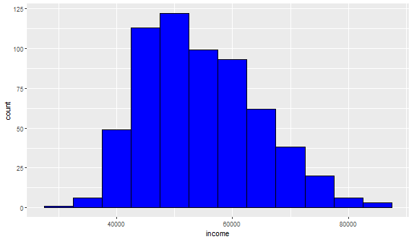

```{r setup, include=FALSE}
knitr::opts_chunk$set(echo = FALSE)
```

## R Markdown

```{r directory, include=FALSE}
setwd("~/GitHub/DSCI605/Mod7")
```

# 1. How to emebed image into R Markdnow

This is an example of embedding images in your local folder into R Markdown.
For example, I have a illustration graph of the links between packages ggplot2, gtable, grid, egg and gridExtra under the folder Mod7. This plot approach only works for HTML.  It does not work for a pdf or LaTex approach which uses LaTex for for figure referencing.



This is another way to insert the image and set the position for the image.  However, in this approach there is no way to keep the figure with the text.

```{r rein0, include = TRUE,fig.align = 'center', out.width = "50%", fig.cap = "\\label{fig:rein0}Resized Schematic illustration of my own file."}

knitr::include_graphics("AI4.jpg")
```

This is still another way to insert the image and set the position for the image.  Using LaTex, it keeps the figure with the text.

\begin{figure}[H]  % Forcing the image to be placed right here
  \centering
  \includegraphics[width=0.5\linewidth]{AI4.jpg}
  \caption{Another Schematic of my own AI file.}
  \label{fig:rein1}
\end{figure}


# 2. Create a high quality figure in R Markdown

This is an example of plotting graphs by setting the plotting area and resolution.
For example, I create a histogram below and set the width, height and resolution in the Chunk options. You can also define the figure size in YAML header and/or define the figure size as global chunk option. This is my own text.

```{r save_plot, include=FALSE}
library(ggplot2)
df <- read.csv("Income-by-states.csv")
ggsave("histogram3_plot.png", ggplot(df, aes(x=income)) + 
      geom_histogram(binwidth=10000, color="black", fill="green"), width = 7, height = 6, dpi = 300)
```

\begin{figure}[H]
  \centering
  \begin{minipage}{0.9\textwidth}
    \includegraphics[width=\textwidth]{histogram3_plot.png}
  \end{minipage}%
  \begin{minipage}{0.9\textwidth}
    \centering
  \end{minipage}
  \caption{A histogram of incomes by state}
  \label{fig:fig4}
\end{figure}

# 3. Refer to the figure by indexing the figure.

In Figure \ref{fig:figs1}, we see that the distribution of incomes is close to a normal distribution.
In Figure \ref{fig:rein0}, we see the illustration graph.  There is no correct labeling of Figure 1, so it cannot be found.

# 4. Create tables using the kable function from the knitr package.

kable takes a data.frame as input, and outputs the table into a markdown table, which will get rendered into the appropriate output format.

For example, let’s say we wanted to share the first 6 rows of our mtcars data.

This gives us the following output:
```{r tabl,include=TRUE}
top_mtcars <- head(mtcars)

knitr::kable(top_mtcars,caption= "A Knitr's kable to show the first six rows of 'mtcars'",digits=2)

```

# 5. Refer to the tables


For example, let’s say we wanted to share the first 10 rows of our mtcars data.

This gives us the following output:
```{r tabl1,include=TRUE}
top_mtcars <- head(mtcars,10)

knitr::kable(top_mtcars,caption= "A Knitr's kable to show the first ten rows of 'mtcars'",digits=2)

```

In Table \ref{tab:tbl1}, we see the first **10** rows  of the dataset "mtcars".

Let's try this again:

```{r tabl3,include=TRUE}
mytop_mtcars <- head(mtcars,10)
    
knitr::kable(mytop_mtcars, digits=2, caption = "A Knitr's kable to show the first ten rows of 'mtcars' \\label{tab:tabl3}") 
```

Once again in Table \ref{tab:tabl3}, we see the first **10** rows  of the dataset "mtcars".